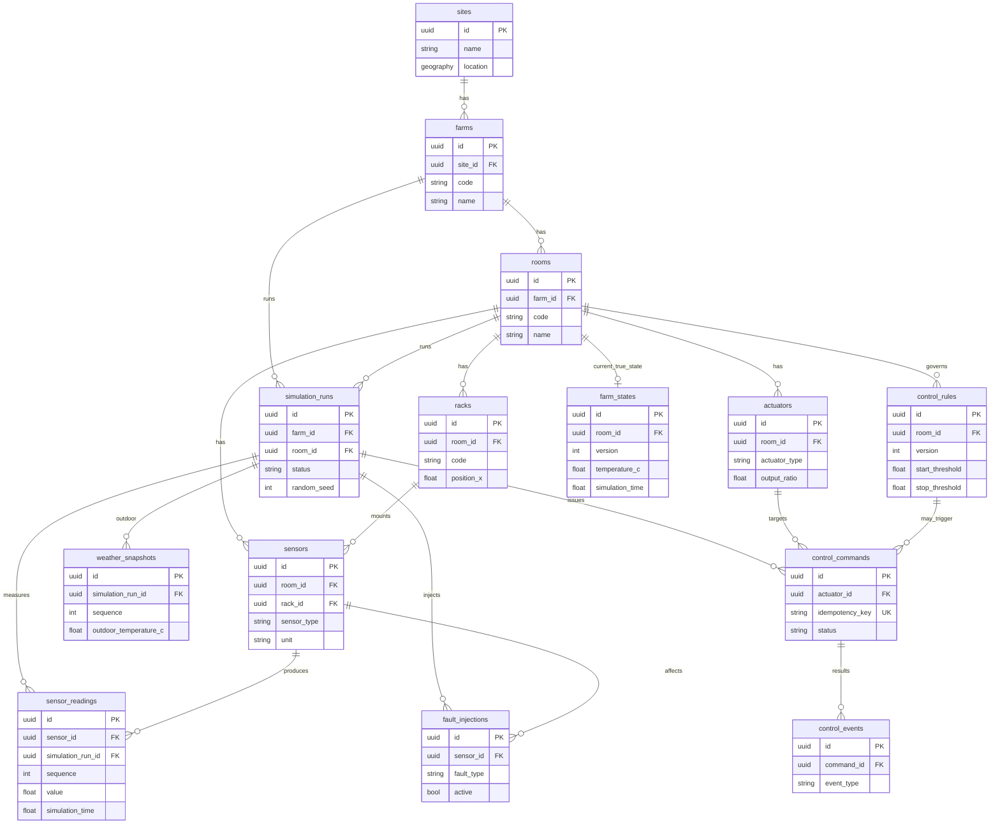

# ERD — 2단계 도메인 기준선

Alembic revision `c18bc480b9e7_domain_baseline_day7` 과 일치한다.

## 참값 · 측정값 · 명령 · 결과

| 구분 | 테이블 | 역할 |
|---|---|---|
| 참값 | `farm_states` | 환경 모델이 계산한 내부 상태 |
| 측정값 | `sensor_readings` | 가상 센서 관측 (append-only) |
| 명령 | `control_commands` | 액추에이터 목표 |
| 결과 | `control_events` | 적용·정지·실패 이력 |
